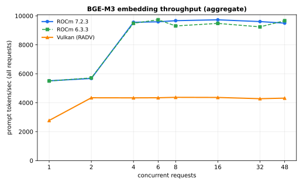
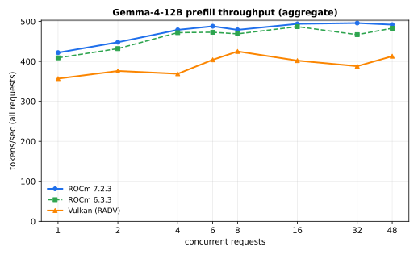
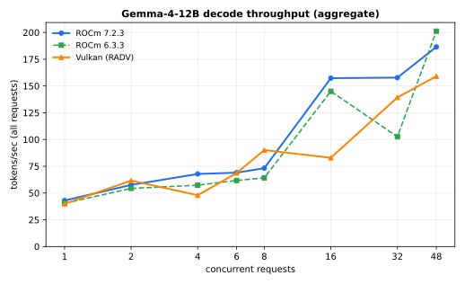
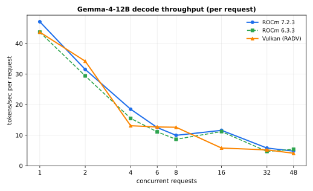
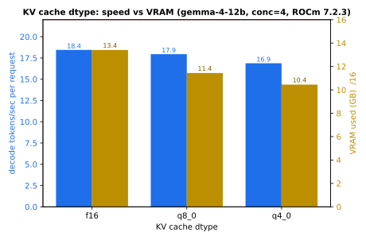

# llama.cpp on MI50 / gfx906 — backend & KV-cache benchmarks

Benchmarks of **gemma-4-12B** (chat) and **bge-m3** (embeddings) served by
llama.cpp on an AMD Radeon **MI50 / Radeon Pro VII (gfx906, Vega 20, 16 GB)**,
comparing three backends and the KV-cache dtype tradeoff.

## TL;DR

- **Compute-bound work → ROCm wins, decisively.** Embeddings run **~2.2× faster**
  on ROCm than Vulkan; gemma prefill **~20% faster**. ROCm's tuned rocBLAS/Tensile
  GEMM kernels are the whole reason the gfx906 fork exists.
- **Bandwidth-bound decode → roughly a wash.** Single-stream decode is a tie
  (~43 tok/s); at higher concurrency the curves cross around and are noisy — no
  clean backend winner. (An earlier `parallel=8` run had Vulkan ahead on batched
  decode; at `parallel=48` it's muddier.)
- **ROCm 6.3.3 ≈ ROCm 7.2.3.** No meaningful difference anywhere, despite gfx906
  being "officially dropped" in ROCm 7. mixa3607's 7.x patch doesn't regress.
- **f16 KV cache is the right default on this card.** It decodes fastest (no
  per-step dequant on a compute-weak GPU) and VRAM allows it. q8/q4 only buy VRAM,
  at a decode cost.
- **Decision: ROCm 7.2.3 + f16 KV.** A low-concurrency RAG chat+embed workload is
  dominated by embedding + prefill, where ROCm wins.

## Setup

| | |
|--|--|
| GPU | AMD Radeon Pro VII / MI50 (gfx906 / Vega 20), 16 GB HBM2 |
| llama.cpp build | **b9623** (identical across all three backends → clean A/B) |
| ROCm images | `mixa3607/llama.cpp-gfx906:b9623-rocm-7.2.3` and `…-rocm-6.3.3` |
| Vulkan image | `localhost/llamacpp-vulkan-b9623` (b9623 *release* tarball + mesa RADV; see note) |
| Models | gemma-4-12B-it Q4_K_M (**f16 KV**) + bge-m3 FP16, router mode, co-resident |
| Config | `ctx 8192`, `parallel 48`, VRAM ~13.3 GB / 16 |

**Method:** `bench_llamacpp.py` fires N requests simultaneously (a `Barrier`), best
of 3 waves. Unique prompts + `cache_prompt=false` (real prefill, no cache cheat).
Prefill = ~170-tok prompts, `gen=1` (isolates prompt processing). Decode = exactly
128 generated tokens (`ignore_eos`). Embed = ~180-tok inputs. Per-request rates are
llama.cpp's own server-side `timings`; aggregate = total tokens / wall.

> **Vulkan-image gotcha:** the official `ghcr.io/ggml-org/llama.cpp:server-vulkan`
> is **broken** — `libggml-vulkan.so` has an undefined symbol from an incomplete
> shader-gen build (issue #20868; docs note GPU images aren't CI-tested) → "no
> usable GPU found". RADV itself is fine (vulkaninfo enumerates the Vega20). The
> b9623 *release tarball* is intact, so `llamacpp-vulkan/Dockerfile` wraps it in
> ubuntu + mesa-vulkan-drivers. SELinux/rootless were **not** the blocker.

> **Note on decode noise:** decode aggregate is bumpy in the 8–48 range (slot-
> scheduling / warmup variance survives best-of-3). Treat the decode curves as
> trends, not precise points. Prefill and embeddings are clean and reproducible.

---

## Embeddings — bge-m3 (prompt processing)

ROCm saturates ~**9,600 tok/s**; Vulkan plateaus ~**4,300 tok/s**. **ROCm ≈ 2.2×.**
Clean, consistent. (Both ROCm builds identical.)



| conc | ROCm 7.2.3 | ROCm 6.3.3 | Vulkan | req/s (ROCm) |
|--:|--:|--:|--:|--:|
| 1  | 5514 | 5501 | 2773 | 30 |
| 2  | 5677 | 5714 | 4340 | 31 |
| 4  | 9557 | 9487 | 4335 | 53 |
| 8  | 9667 | 9304 | 4370 | 53 |
| 16 | 9726 | 9479 | 4362 | 54 |
| 32 | 9606 | 9240 | 4277 | 54 |
| 48 | 9498 | 9665 | 4315 | 53 |

*(tok/s, aggregate. ~180-tok inputs; with short-sentence inputs req/s is much higher.)*

---

## Gemma prefill — prompt processing (compute-bound)

A fixed pie (~**490 tok/s** ROCm, ~**400** Vulkan) that just divides by concurrency.
**ROCm ~20% faster**, flat across load. This is the real chat ceiling: long RAG
prompts spend most of their latency here.



| conc | ROCm 7.2.3 | ROCm 6.3.3 | Vulkan |
|--:|--:|--:|--:|
| 1  | 422 | 409 | 357 |
| 4  | 479 | 472 | 369 |
| 8  | 479 | 469 | 425 |
| 16 | 494 | 487 | 402 |
| 32 | 496 | 467 | 388 |
| 48 | 492 | 483 | 413 |

*(tok/s aggregate. Per-request prefill = total ÷ concurrency.)*

---

## Gemma decode — token generation (bandwidth-bound)

Single-stream ~**43 tok/s** on all three (tie). Aggregate climbs with concurrency
to ~**150–200 tok/s** at 48-way; per-request craters to ~5 tok/s. Backend ordering
is noisy and crosses — no clean winner.




| conc | ROCm7 tot | ROCm6 tot | Vulkan tot | ROCm7 /req | Vulkan /req |
|--:|--:|--:|--:|--:|--:|
| 1  | 43.0 | 40.4 | 39.9 | 47.1 | 43.7 |
| 2  | 57.6 | 54.3 | 61.6 | 31.5 | 34.2 |
| 4  | 67.8 | 57.3 | 47.9 | 18.5 | 13.1 |
| 8  | 73.2 | 64.2 | 90.1 | 9.96 | 12.6 |
| 16 | 157.3 | 145.0 | 82.9 | 11.6 | 5.8 |
| 32 | 157.8 | 102.6 | 139.3 | 5.8 | 5.2 |
| 48 | 186.5 | 201.2 | 159.1 | 4.8 | 4.1 |

**Key UX point:** decode barely batches on this card and per-user rate falls fast
(47 → ~5 tok/s from 1 → 48 concurrent). For interactive chat, keep concurrency low
(`parallel≈4`): ~18 tok/s/user at near-peak-efficiency aggregate.

---

## KV cache dtype — the f16 "free win"

gemma weights are Q4, so quantizing the KV cache *seems* natural. It isn't, here.
gfx906 is compute-weak, so the per-step dequant a quantized cache needs costs more
than the bandwidth it saves → **f16 decodes fastest**. Prefill is untouched (it's
GEMM, not KV). The only thing quantized KV buys is VRAM — which this workload has.



ROCm 7.2.3, gemma-4-12B, concurrency 4:

| KV dtype | decode tok/s/req | decode tok/s tot | prefill tot | VRAM used |
|--|--:|--:|--:|--:|
| **f16**  | **18.45** | **67.3** | 476 | 13.41 GB |
| q8_0     | 17.95 (−2.7%) | 65.9 | 470 | 11.44 GB |
| q4_0     | 16.88 (−8.5%) | 62.2 | 467 | 10.45 GB |

**Rule:** use **f16 KV** unless VRAM-bound at long context; only then drop to q8/q4
(q4 frees ~3 GB for ~8% decode). The same logic made **bge-m3 FP16** (not Q8) the
embedding default — an earlier A/B measured FP16 ~15–19% faster than Q8 on this card.

---

## Conclusions

1. **ROCm for this card, ROCm 7.2.3 specifically** (6.3.3 is equivalent; 7.2.3 is
   the maintained line). Vulkan is a viable *fallback* but pays ~2× on embeddings
   and ~20% on prefill — the two things a RAG workload leans on.
2. **f16 everywhere it counts** (KV cache + embedding weights). Counterintuitive
   vs "quantize all the things," but correct on a compute-weak GPU with VRAM to spare.
3. **Low concurrency for interactive chat.** Decode doesn't amortize well; `parallel≈4`
   is the UX sweet spot (~18 tok/s/user). High concurrency only helps bulk/offline.
4. **Vulkan is the move only for a high-concurrency batched-decode workload** — the
   one regime where it's competitive — and it's higher-maintenance (rebuild the
   release-wrapper image per bump vs `docker pull` a tag).

## Reproduce

```bash
# backends (one at a time — one GPU):
podman compose -f docker-compose.llamacpp-rocm7.yml up -d     # ROCm 7.2.3
podman compose -f docker-compose.llamacpp-rocm6.yml up -d     # ROCm 6.3.3
podman build --build-arg LLAMA_BUILD=b9623 -t localhost/llamacpp-vulkan-b9623 llamacpp-vulkan/
podman compose -f docker-compose.llamacpp-vulkan.yml up -d    # Vulkan

# bench (needs parallel>=N in llamacpp/models.ini to exercise concurrency N):
python3 bench_llamacpp.py 1,2,4,6,8,16,32,48 gemma
python3 bench_llamacpp.py 1,2,4,6,8,16,32,48 embed

# charts (any matplotlib env):
python plot.py
```

All files in this directory: `bench_llamacpp.py` (harness), `models.ini` +
`docker-compose.llamacpp-*.yml` + `llamacpp-vulkan/Dockerfile` (the exact configs
benchmarked), `plot.py` (chart source), `bench-{rocm7,rocm6,vulkan,kvcache}.log`
(raw output), `*.svg` (charts).
